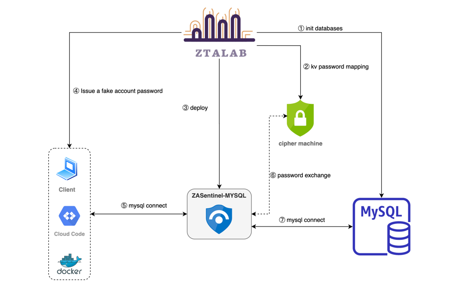

# ZASentinel-MYSQL
 

⭐ The zero-trust security component in the MYSQL environment enhances the security of MYSQL data access in a non-intrusive form.

## 💪🏻 Features
1. Powerful performance and extremely low resource consumption
2. Only parse the authentication protocol message, after the authentication is successful, the command executes and responds to the transparent proxy, which is fast
3. Hide mysql itself, hide mysql authentication account password
4. Compatible with mysql 5.x ~ mysql 8.0
5. Easy access, no need to do any adaptation work, just fill in the correct address
6. Support vault secret storage component
----

## License

ZASentinel-MYSQL is under the Apache 2.0 license. See the LICENSE directory for details.

